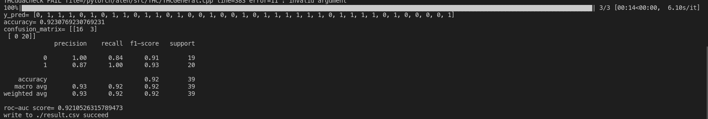

# skin_disease_two_classification
### Resnet50 for migration learning to achieve image binary classification

#### Introduction
In this paper, we use the pre-trained Resnet50 network for binary classification of skin disease images, based on the portch framework.
- A project on image multiclassification is referenced:[project address](https://github.com/ikkyu-wen/huawei-garbage).


#### dataset description
The dataset is stored in the directory: used_dataset , with a total of 200 images, labeled as: benign (benign), malignant (diseased).

- The dataset is divided as follows:
 
Dataset type | benign | malignant | totall
-------- | ---- | ------- | -----
train | 64 | 64 | 128 
val | 16 | 16 | 32
test | 20 | 20 | 40

#### Code directory introduction
1. args.py holds the various parameters used for training and testing.
	  The --mode field indicates the mode of operation: train or test. 
	  The --model_path field is the path where the training model is stored.
	  The rest of the fields have default values.
2. create_dataset.py This script is used to read the data from the json, and can be ignored.
3. data_gen.py This script implements the division of the dataset as well as data enhancement and data loading.
4. main.py Contains training, evaluation and testing.
5. transform.py implements image enhancement.
6. utils.py holds some utility functions. 7. models/Res.py is the main script.
7. models/Res.py is a rewrite of ResNet for various types of networks. 8. checkpoints holds the models.
8. checkpoints holds the models

#### Run command

```python
# Train Mode
python main.py --mode=train
# Test Mode
python main.py --mode=test --model_path='/home/rog/桌面/skin_disease_two_classification-master/skin_two_classification/checkpoints/model_16_7165_10000.pth'   
```
#### main.py Introduction to the script
###### main() function implements model training and evaluation.
 - step1: Load data 
```python
# data
    transformations = get_transforms(input_size=args.image_size,test_size=args.image_size)
    train_set = data_gen.Dataset(root=args.train_txt_path,transformations=transformations['val_train'])
    train_loader = data.DataLoader(train_set,batch_size=args.batch_size,shuffle=True)

    val_set = data_gen.ValDataset(root=args.val_txt_path,transform=transformations['val_test'])
    val_loader = data.DataLoader(val_set,batch_size=args.batch_size,shuffle=False)
```
   - step2: Build the model

```python
model = make_model(args)
    if use_cuda:
        model.cuda()
    
    # define loss function and optimizer
    if use_cuda:
        criterion = nn.CrossEntropyLoss().cuda()
    else:
        criterion = nn.CrossEntropyLoss()
	
    optimizer = get_optimizer(model,args)
    scheduler = torch.optim.lr_scheduler.ReduceLROnPlateau(optimizer, mode='min', factor=0.2, patience=5, verbose=False)
```
- step3: Model training and evaluation
   
```python
# train
    for epoch in range(start_epoch,args.epochs):
        print('\nEpoch: [%d | %d] LR: %f' % (epoch + 1, args.epochs, optimizer.param_groups[0]['lr']))

        train_loss,train_acc = train(train_loader,model,criterion,optimizer,epoch,use_cuda)
        test_loss,val_acc = val(val_loader,model,criterion,epoch,use_cuda)

        scheduler.step(test_loss)

        print(f'train_loss:{train_loss}\t val_loss:{test_loss}\t train_acc:{train_acc} \t val_acc:{val_acc}')

        # save_model
        is_best = val_acc >= best_acc
        best_acc = max(val_acc, best_acc)

        save_checkpoint({
                    'fold': 0,
                    'epoch': epoch + 1,
                    'state_dict': model.state_dict(),
                    'train_acc':train_acc,
                    'acc': val_acc,
                    'best_acc': best_acc,
                    'optimizer' : optimizer.state_dict(),
                }, is_best, single=True, checkpoint=args.checkpoint)

    print("best acc = ",best_acc)

```

###### train() function The process of training the model for each epoch.
- Mainly implement the backpropagation of the gradient under each epoch, calculate the accuarcy and loss, and update it, and finally return its mean value.

```python
def train(train_loader,model,criterion,optimizer,epoch,use_cuda):
    model.train()
    losses = AverageMeter()
    train_acc = AverageMeter()

    for (inputs,targets) in tqdm(train_loader):
        if use_cuda:
            inputs,targets = inputs.cuda(),targets.cuda(async=True)
        inputs,targets = torch.autograd.Variable(inputs), torch.autograd.Variable(targets)

        # The gradient parameter is set to 0
        optimizer.zero_grad()

        # forward
        outputs = model(inputs)
        loss = criterion(outputs, targets)
        
        # compute gradient and do SGD step
        loss.backward()
        optimizer.step()

        # measure accuracy and record loss
        acc = accuracy(outputs.data,targets.data)
        # inputs.size(0)=32
        losses.update(loss.item(), inputs.size(0))
        train_acc.update(acc.item(),inputs.size(0))

    return losses.avg,train_acc.avg
```
###### val() function Model evaluation process under each epoch
- The main code is the same as the train() function, but there is no calculation of the gradient, and there is a change from model.train() to model.eval().

```python
def val(val_loader,model,criterion,epoch,use_cuda):
    global best_acc
    losses = AverageMeter()
    val_acc = AverageMeter()

    model.eval()# Set the model to validation mode
	# Confusion matrix
    confusion_matrix = meter.ConfusionMeter(args.num_classes)
    for _,(inputs,targets) in enumerate(val_loader):
        if use_cuda:
            inputs,targets = inputs.cuda(),targets.cuda()
        inputs,targets = torch.autograd.Variable(inputs), torch.autograd.Variable(targets)

        # compute output
        outputs = model(inputs)
        loss = criterion(outputs, targets)
        confusion_matrix.add(outputs.data.squeeze(),targets.long())
        acc1 = accuracy(outputs.data,targets.data)

        # measure accuracy and record loss
        losses.update(loss.item(), inputs.size(0))
        val_acc.update(acc1.item(),inputs.size(0))
    return losses.avg,val_acc.avg
```

###### test() function Testing of models

```python
def test(use_cuda):
    # data
    transformations = get_transforms(input_size=args.image_size,test_size=args.image_size)
    test_set = data_gen.TestDataset(root=args.test_txt_path,transform= transformations['test'])
    test_loader = data.DataLoader(test_set,batch_size=args.batch_size,shuffle=False)
    # load model
    model = make_model(args)
    
    if args.model_path:
        model.load_state_dict(torch.load(args.model_path))

    if use_cuda:
        model.cuda()

    # evaluate
    y_pred = []
    y_true = []
    img_paths = []
    with torch.no_grad():
        model.eval() # set eval
        for (inputs,targets,paths) in tqdm(test_loader):
            y_true.extend(targets.detach().tolist())
            img_paths.extend(list(paths))
            if use_cuda:
                inputs,targets = inputs.cuda(),targets.cuda()
            inputs,targets = torch.autograd.Variable(inputs), torch.autograd.Variable(targets)
            # compute output
            outputs = model(inputs)  # (16,2)
            # dim=1 means by rows, i.e., softmax each row.
            # probability = torch.nn.functional.softmax(outputs,dim=1)[:,1].tolist()
            # probability = [1 if prob >= 0.5 else 0 for prob in probability]
            # Returns the index of the maximum value
            probability = torch.max(outputs, dim=1)[1].data.cpu().numpy().squeeze()
            y_pred.extend(probability)
        print("y_pred=",y_pred)

        accuracy = metrics.accuracy_score(y_true,y_pred)
        print("accuracy=",accuracy)
        confusion_matrix = metrics.confusion_matrix(y_true,y_pred)
        print("confusion_matrix=",confusion_matrix)
        print(metrics.classification_report(y_true,y_pred))
        # fpr,tpr,thresholds = metrics.roc_curve(y_true,y_pred)
        print("roc-auc score=",metrics.roc_auc_score(y_true,y_pred))
    
        res_dict = {
            'img_path':img_paths,
            'label':y_true,
            'predict':y_pred,

        }
        df = pd.DataFrame(res_dict)
        df.to_csv(args.result_csv,index=False)
        print(f"write to {args.result_csv} succeed ")
```
#### Result
